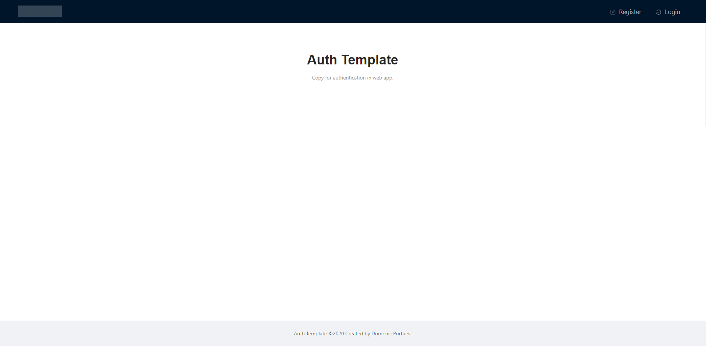
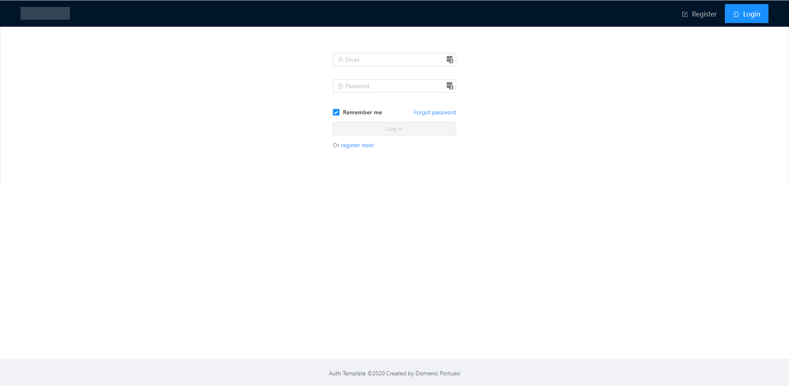

# auth-template-react

A simple authentication template with Node, React, and AWS (Cognito). Uses Ant design for UI components.

### Features: 
- Login page
- Signup page
- Password validation with custom rules (Must also set validation rules in AWS)
- EULA sign in agreement
- Forget password
- Username and password management when logged in (Coming soon)
- Logging in and out (session storing)

## Screenshot

